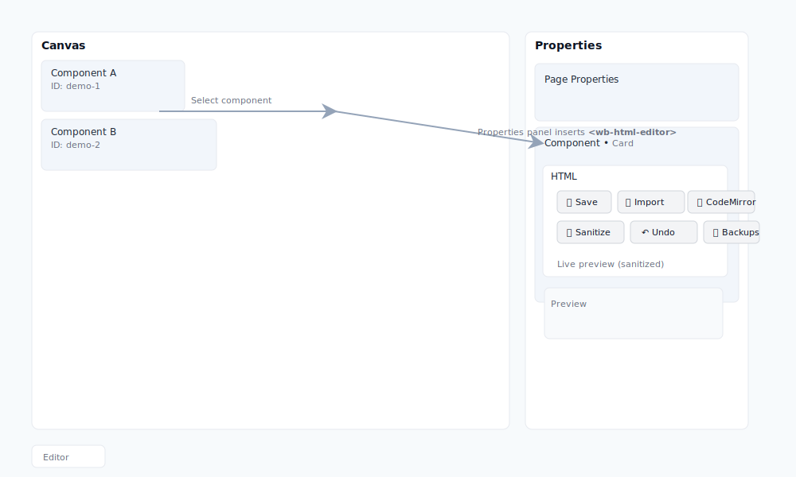

WB HTML Editor — Merge & History (Quick Guide)

Overview
- The `wb-html-editor` lets you view and edit the HTML of the currently selected canvas element or the entire `#canvas`.
- Merge preview shows differences (node + line hunks). You can apply selected hunks only — safe-by-default.
- All merges create automatic backups (persisted to localStorage). Use the Backups list to preview, restore or delete snapshots.

Quick actions
- Import canvas: loads the entire `#canvas` HTML into the editor for large edits.
- Merge Preview: shows node-level hunks with line-level diffs inside each hunk.
  - Select/deselect hunks to apply only the changes you want.
  - "Select all" to apply everything shown.
- Undo (↶): quickly restores the last backup.
- Backups: persistent history (retention set to 20 by default). You can Restore or Delete any snapshot.
- CodeMirror: toggle to enable a richer code editing experience (syntax highlight, undo/redo, find/replace).

Keyboard shortcuts
- Ctrl/Cmd+S — Save (applies edits to selected element or canvas depending on mode)
- Ctrl/Cmd+Shift+I — Import canvas
- Ctrl/Cmd+Z — Undo (editor)

Safety notes
- Preview pane is sanitized to avoid executing user scripts in the preview.
- Save writes raw HTML (scripts and inline event attributes are preserved). Be careful when copying/pasting untrusted HTML.

Developer notes
- Per-hunk and per-line merge behavior is available in the Merge Preview. The editor stores backups in `localStorage` under `wb-html-editor:backups` (retention: 20).
- Public API (available on the element):
  - `editor.openFor(idOrEl, { mode: 'element'|'canvas', enableCodeMirror: true|false })`
  - `editor.importCanvas()`
  - `editor.listBackups()` → returns array of backups
  - `editor.restoreBackup(idx)` → restore by index
  - `editor.applyHunkFromEditor(idx)` → apply single hunk from editor content

How to create a GIF (recommended flow)
1. Start the builder and open the Properties panel for a component.
2. Click "Import canvas" → make a small edit (change a node text, add a new node).
3. Click "Import canvas" again → show Merge Preview → toggle a hunk off/on.
4. Click "Apply selected" → show Backups list → click Undo.
5. Use a screen recorder (e.g., Peek, ScreenToGif, or macOS screen recording) and export as GIF.

## UI placement diagram

This image shows where the `wb-html-editor` appears in the Builder's Properties panel and the main controls you will find in that row (Save, Import, CodeMirror, Sanitize, Undo, Backups, Preview).

Support
- Report issues at the repository's Issues page and tag with `component: wb-html-editor` and `area: builder`.

Changelog (high-level)
- v3.0: Added raw-save, id-based merge, diff preview, backup history, CodeMirror integration, and per-hunk apply.