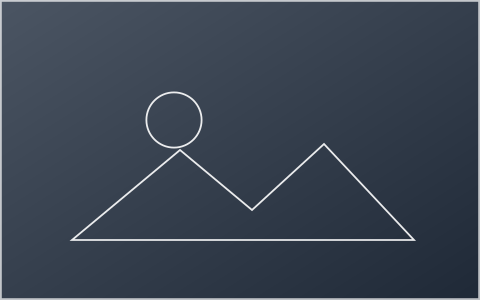

# Masonry

`x-masonry` flows its children into `columns` like a newspaper, so items of different heights pack without gaps. Use it for image walls and cards of uneven length.

## Usage

  
  
  
  

## Attributes

| Attribute | Values | Default | Description |
| --- | --- | --- | --- |
| `columns` | `string` | `3` | Number of masonry columns. Defaults to `3`. |
| `gap` | `string` | `1rem` | Space between items, as a CSS length. Defaults to `1rem`. |

Schema: [`masonry.schema.json`](../../src/wb-models/masonry.schema.json)
